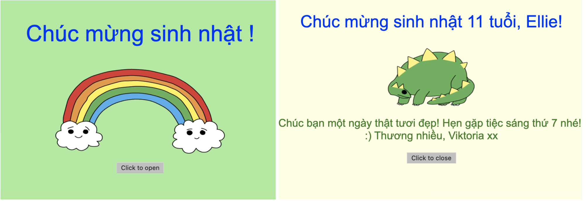

## Giới thiệu

Trong dự án này, bạn sẽ được giới thiệu về HTML và CSS bằng cách tìm hiểu cách tạo thiệp sinh nhật tùy theo nhu cầu của riêng bạn.

### Những gì bạn sẽ làm

Nhấn vào nút để mở thiệp sinh nhật:

  <iframe src="https://trinket.io/embed/html/c3d52cf65c?outputOnly=true&start=result" width="600" height="450" frameborder="0" marginwidth="0" marginheight="0" allowfullscreen>
  </iframe>
  

### Những gì bạn sẽ học

Dự án này bao gồm các nội dung từ các chương trình [Raspberry Pi Digital Making Curriculum](http://rpf.io/curriculum){:target="_blank"}:

+ [Design basic 2D and 3D assets](https://www.raspberrypi.org/curriculum/design/creator){:target="_blank"}.

### Thông tin bổ sung cho người hướng dẫn

Nếu bạn cần in dự án này, vui lòng sử dụng [bản in](https://projects.raspberrypi.org/en/projects/happy-birthday/print){:target="_ blank"} .

Sử dụng đường link ở cuối trang để truy cập vào repo GitHub cho dự án này, nơi chứa tất cả các tài nguyên (bao gồm một dự án mẫu đã hoàn thành) trong thư mục 'en/resources'.