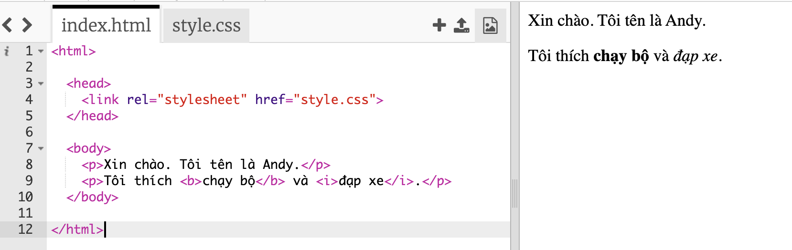
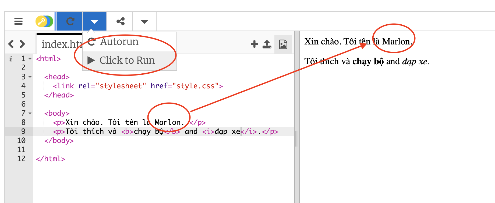

## HTML là gì?

HTML là viết tắt của **Ngôn ngữ đánh dấu siêu văn bản**, ngôn ngữ được sử dụng để tạo các trang web. Hãy xem một ví dụ!

Bạn sẽ sử dụng một trang web có tên là trinket.io để viết mã HTML.

+ Mở [trinket này](http://jumpto.cc/web-intro) {:target ="_trống"}.

Dự án sẽ trông giống như thế này:



Mã mà bạn có thể thấy ở bên trái là HTML. Ở bên phải của trinket, bạn có thể thấy trang web mà mã HTML đã tạo.

HTML sử dụng **thẻ** để xây dựng trang web. Tìm mã HTML này trên dòng 8 của mã của bạn:

```html
<p>Xin chào. Tôi tên là Andy.</p>
```

`<p>` là một ví dụ về thẻ và là viết tắt của **đoạn**. Bạn có thể bắt đầu một đoạn bằng `<p>` và kết thúc một đoạn bằng `</p>`.

+ Bạn có thể nhận thấy bất kỳ thẻ nào khác không?

## \--- sụp đổ \---

## tiêu đề: Trả lời

Một thẻ khác bạn có thể đã phát hiện là `<b>`, viết tắt của **in đậm**:

```html
<b>chạy</b>
```

Dưới đây là một số chi tiết khác:

+ `<html>` và `</html>` đánh dấu điểm bắt đầu và kết thúc của tài liệu HTML
+ `<head>` và `</head>` là nơi những thứ như CSS đi (chúng ta sẽ nói đến việc đó sau)
+ `<body>` và `</body>` là nơi nội dung trang web của bạn đi đến


\--- /sụp đổ \---

+ Thay đổi một trong các đoạn văn bản trong tệp HTML (ở bên trái). Nhấp vào **Chạy** và bạn sẽ thấy trang web của mình thay đổi (ở bên phải)!



+ Nếu bạn tạo lỗi và muốn hoàn tác tất cả các thay đổi của mình, bạn có thể nhấp vào **menu** và sau đó nhấp vào **Đặt lại**.


Để hoàn tác việc cuối cùng bạn đã làm, bạn có thể nhấn các phím `Ctrl` và `z` chung với nhau.

### Bạn không cần tài khoản Trinket để lưu dự án của bạn!

Nếu bạn không có tài khoản Trinket, hãy nhấp vào mũi tên </strong>xuống</strong> và nhấp vào **Link</0>. Điều này sẽ cung cấp cho bạn một liên kết mà bạn có thể lưu lại và vào lại sau. Bạn sẽ cần phải làm điều này mỗi khi bạn tạo thay đổi, vì liên kết sẽ thay đổi!</p> 


Nếu bạn có tài khoản Trinket, cách dễ nhất để lưu trang web của bạn là nhấp vào nút **Remix** trên đỉnh của trinket. Điều này sẽ lưu một bản sao của trinket trên hồ sơ của bạn.

