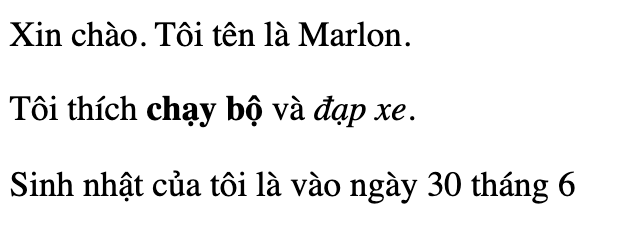

\--- challenge \---

## Thử thách: thêm một đoạn khác

- Bạn có thể thêm một đoạn văn bản thứ ba vào trang web của bạn, bên dưới hai đoạn văn bản khác không?

Hãy nhớ rằng đoạn mới của bạn nên bắt đầu bằng thẻ `
` và kết thúc bằng nhãn `
`.

Đây là cách trang web của bạn có thể trông giống:

Bạn có thể thêm **in đậm** và <u>gạch chân</u> văn bản đến đoạn mới của bạn không? Sử dụng thẻ `<u>` và `</u>` cho văn bản gạch chân.

\--- /challenge \---