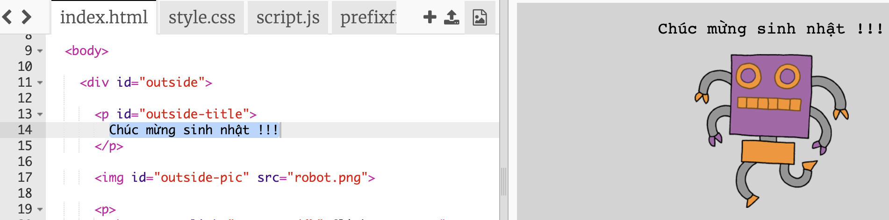
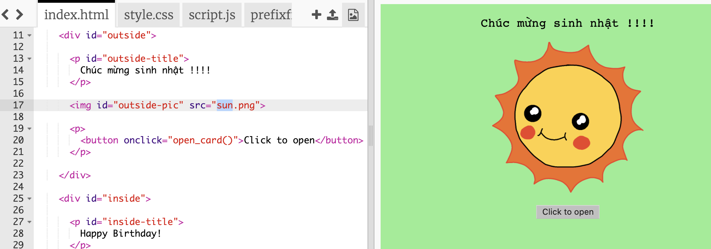
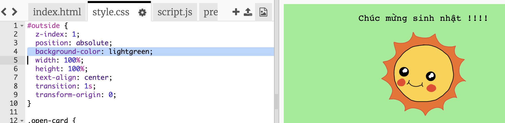
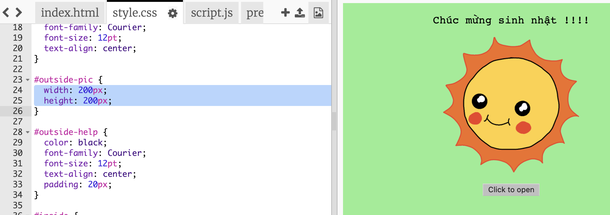
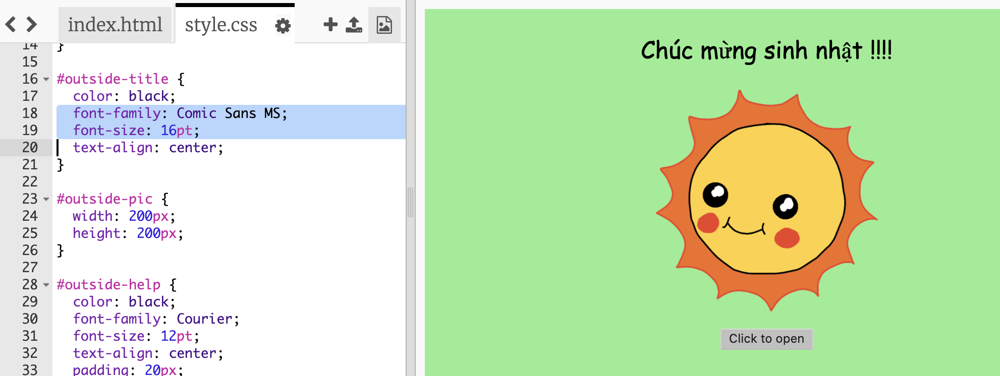

## Làm thiệp sinh nhật

Hãy sử dụng những gì bạn đã học về HTML và CSS để tạo thiệp sinh nhật tùy nhu cầu của riêng bạn.

+ Mở [trinket này](http://jumpto.cc/web-card){:target="_blank"}.

Chúng tôi đã viết rất nhiều mã để giúp bạn bắt đầu, nhưng thiệp sinh nhật có sẵn trông khá nhàm chán, vì vậy bạn sẽ thực hiện một số thay đổi đối với mã HTML và CSS.

+ Nhấp vào nút ở mặt trước của thiệp và bạn sẽ thấy nó mở để lộ bên trong.

+ Chuyển đến dòng 14 của mã HTML. Hãy thử chỉnh sửa văn bản để tùy chỉnh theo ý thiệp của bạn.

+ Bạn có thể tìm mã HTML cho hình ảnh robot và thay đổi từ `robot` thành `mặt trời` không?

\--- hints \--- \--- hint \---

+ Nhìn vào dòng 17 để tìm mã.
+ Thay đổi từ `robot` đến `mặt trời` và bạn sẽ thấy sự thay đổi hình ảnh!

 \--- /hint \--- \--- /hints \---

Bạn có thể sử dụng bất kỳ các từ `cậu bé`, `kim cương`, `khủng long`, `hoa`, `cô gái`, `cầu vồng`, `robot`, `tàu vũ trụ`, `mặt trời`, `trà` hoặc `cúp` cho một thiệp sinh nhật hoặc `bánh qui`, `yêu tinh`, `chim cánh cụt`, `quà tặng`, `tuần lộc`, `ông già Noel` hoặc `người tuyết` nếu bạn muốn làm một tấm thiệp Giáng sinh.

Bạn cũng có thể chỉnh sửa mã CSS của thiệp sinh nhật.

+ Nhấp vào tab cho `style.css `. Phần đầu tiên là tất cả các kiểu CSS cho **bên ngoài** của tấm thiệp.

+ Thay đổi `màu nền` đến `màu xanh lá cây`.

+ Bạn cũng có thể thay đổi kích thước của một hình ảnh. Chuyển đến mã CSS của `#bên ngoài pic` và thay đổi `độ rộng` và `chiều cao` của hình ảnh bên ngoài đến `200px` (`px` là viết tắt của pixel).

+ Phông chữ cũng có thể được thay đổi. Chuyển đến mã CSS `#bên ngoài tiêu đề` và thay đổi `dòng phông chữ` đến `Comic Sans MS` và `cỡ chữ` đến `16pt`.

Bạn có thể sử dụng các phông chữ khác, ví dụ:

+ `arial`
+ `Tác động`
+ `Tahoma`