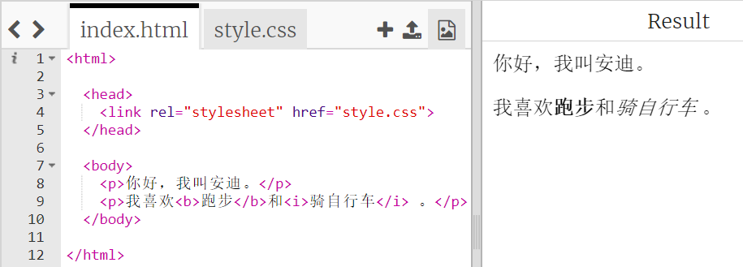
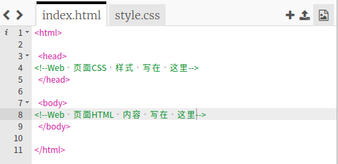
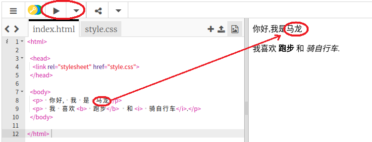
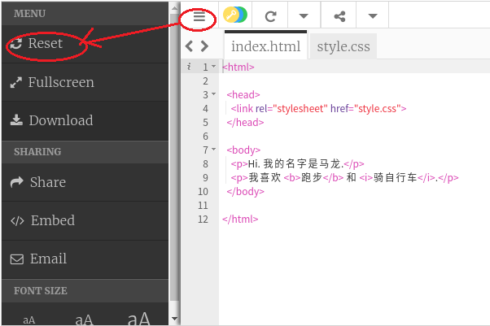
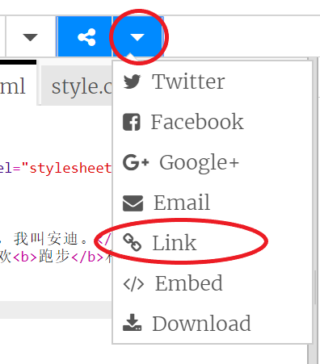
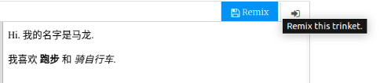

## HTML 是什么？

HTML就是**超文本标记语言**，这种语言可以用来制作网页。让我们来看一下例子吧！

您将会使用trinket.io的网站来编写HTML代码。

+ 打开[该饰品](http://jumpto.cc/web-intro){:target="_blank"}

这个项目应该是这样的：



您可以在左侧看到的HTML代码。在界面的右侧，您可以看到HTML代码所创建的网页。

HTML 使用 **标签** 构建网页。请查看第8行中的 HTML 代码：

```html
<p>您好。我叫安迪。 </p>
```

`<p>`是标记的示例，是**段落的缩写** 。您可以以`<p>`开头段落，以`结束段落</p>` 。

+ 您还能发现其他标签吗？

## \--- collapse \---

## 标题：答案

您可能会发现的另一个标签是`<b>`，它表示** 粗体 ** ：

```html
<b>跑步</b>
```

以下是一些想法：

+ `<html>`和` </html>`标记HTML文档的开始和结束
+ `<head>`和` </head>`是CSS之类的东西（我们稍后会介绍）
+ `<body>`和`</body>`是您网站内容的位置



\--- /collapse \---

+ 更改HTML文件中的文本段落之一（在左侧）。点击**运行** ，您应该会看到网页更改（在右侧）！



+ 如果输入有误，并且要撤消所有更改，则可以单击**菜单**按钮，然后单击**重置** 。



要撤消您所做的最后一件事，可以按` Ctrl `和` z `键。

### 您不必注册Trinket帐户来保存项目！

如果您没有Trinket帐户，请单击向下箭头，然后单击**Link**（链接） 。 页面会显示此项目的链接。你可以先保存这个链接，用于以后继续编辑你的项目。 每次您进行更改时，您都需要这样做，因为链接会改变！



如果您有Trinket帐户，保存网页的最简单方法是单击** Remix **顶部的按钮。这会将副本保存在您的个人资料中。

