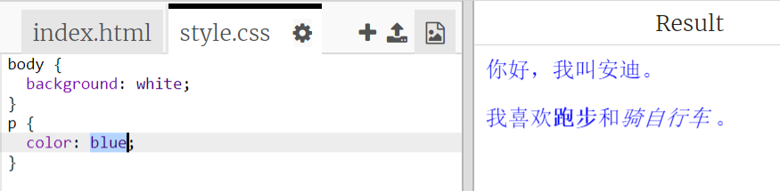

## 什么是 CSS？

CSS代表**Cascading Style Sheets**（级联样式表） ，它是一种用于设置网页样式并使其外观精美的语言。

+ 此代码将您的网页链接到CSS文件——看看是否可以在HTML文档的`<head>`中找到它：


CSS列出了所有对于特定标签的**properties**（属性）。

+ 单击` style.css `标签以查看您网页的CSS代码。
    
    

+ 查找此代码：

```html
p {
    color: black;
}
```

此CSS代码确定段落（`p`）的属性，表示文字颜色应为黑色。注意“颜色”美国的拼写为“color”。

+ 将CSS代码中的单词“black”更改为“blue”。您应该看到所有段落的文本颜色变为蓝色。

