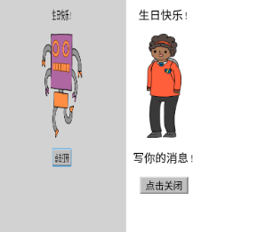
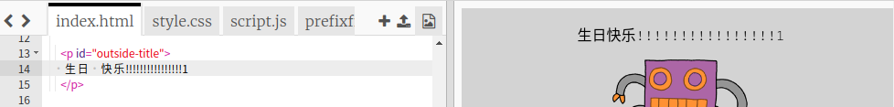
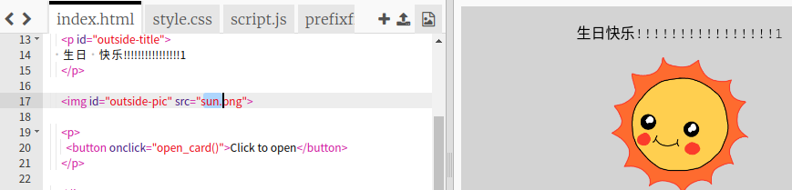
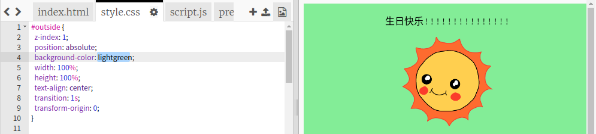
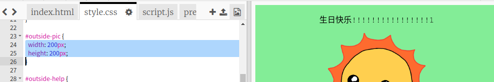
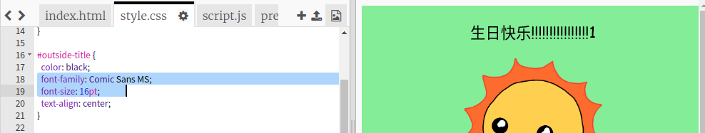

## 制作一张生日贺卡

让我们使用你已经学到的关于HTML和CSS的知识来制作你自己的自定义生日卡。

+ 打开 [trinket](https://trinket.io/html/b33e4f4ca8){:target="_blank"}.

我们已经写了很多代码来帮助您入门，但是到目前为止，生日贺卡看起来很无聊，因此您将对HTML和CSS代码进行一些更改。

+ 单击卡正面的按钮，您应该看到它已打开以露出内部。

+ 转到HTML代码的第14行。尝试编辑文本以自定义您的卡片。

+ 您能找到机器人图像的HTML代码，并更改单词` 机吗器人 `为` 太阳 ` ？

\--- hints \--- \--- hint \---

+ Look on line 17 to find the code.
+ 将单词`机器人`更改为`太阳`，您将看到图像更改！

\--- /hint \--- \--- /hints \---

You can use any of the words `boy`, `diamond`, `dinosaur`, `flowers`, `girl`, `rainbow`, `robot`, `spaceship`, `sun`, `tea`, or `trophy` for a birthday card, or `cracker`, `elf`, `penguin`, `present`, `reindeer`, `santa`, or `snowman` if you would prefer to make a Christmas card.

You can also edit the CSS code of the birthday card.

+ 单击选项卡上的` style.css ` 。第一部分是**外部的所有CSS样式**卡的。

+ 更改`背景色`至`浅绿色` 。

+ 您还可以更改图像的大小。 转到`＃outside-pic ` CSS代码，并更改`宽度`和`高度`外部图像的像素为` 200px ` （` px `代表像素）。

+ 字体也可以更改。转到`＃outside-title ` CSS并更改` font-family `到` Comic Sans MS `和` font-size `至` 16pt ` 。

You can use other fonts, for example:

+ `arial`
+ `Impact`
+ `Tahoma`