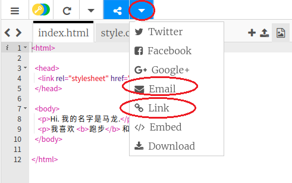

--- challenge ---

## 挑战：制作一张个性化贺卡

+ 使用您所学到的有关HTML和CSS的所有知识来完成个性化卡片的制作。不一定是制作生日贺卡，也可以是用在圣诞节或其他场合的贺卡！

下面是一个例子：

您可以在[此处](http://jumpto.cc/colours){:target="_blank"}找到更多CSS颜色名称。

+ 一旦您完成了您的卡片，您可以分享或发送电子邮件给某人。

--- /challenge ---

***
该项目由以下志愿者翻译：

齐琨

Zhongxi Li

正因为志愿者们的辛勤工作，我们才能为世界各地的人们提供用母语来学习的机会。您也可以通过志愿翻译工作来帮助我们吸引更多的人 - 更多信息，请访问[rpf.io/translate](https://rpf.io/translate)。