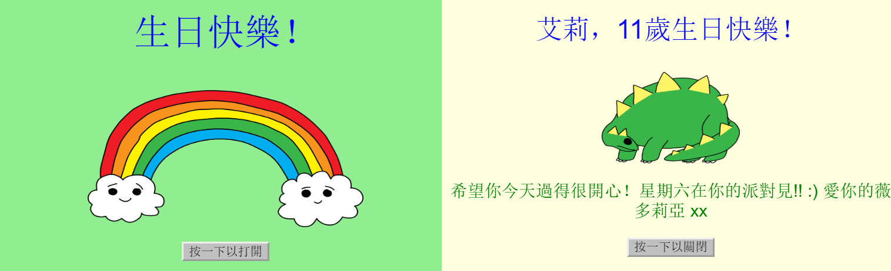

## 簡介

在這個專案中，您將透過創造自己的定製生日賀卡來學習HTML和CSS 。

### 你會做出:

點擊按鈕打開生日卡片：

  <iframe src="https://trinket.io/embed/html/c3d52cf65c?outputOnly=true&start=result" width="600" height="450" frameborder="0" marginwidth="0" marginheight="0" allowfullscreen>
  </iframe>
  

### 你會學到︰

這專案包含了以下幾個 [Raspberry Pi數位製作課程](http://rpf.io/curriculum){：target =“_ blank”}的基本內容：

+ [設計基本的2D和3D物品](https://www.raspberrypi.org/curriculum/design/creator){：target =“_ blank”}。

### 給教育工作者的額外資訊

如果您需要列印此專案內容，請下載 [列印版本](https://projects.raspberrypi.org/en/projects/happy-birthday/print){：target =“_ blank”}。

使用頁腳中的連結訪問此專案的 GitHub 存儲庫，在 'en / resources' 資料夾中有所有的資源(包括已完成的專案範例)。