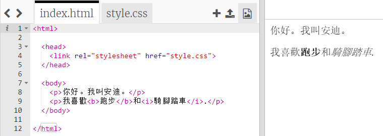
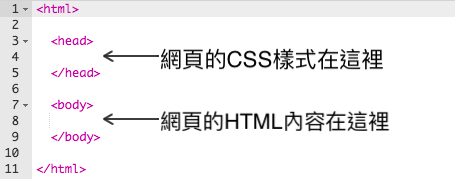
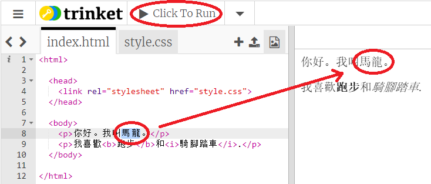
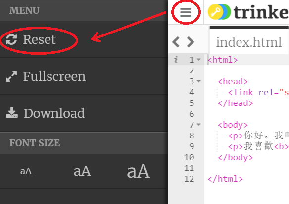
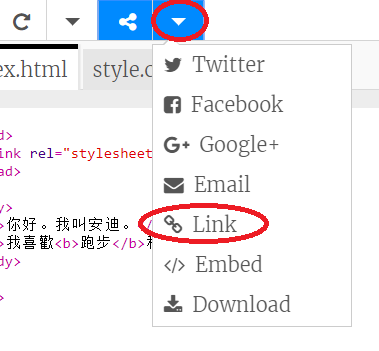
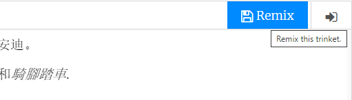

## 什麼是HTML？

HTML代表 **超文本標記語言**，這是用於製作網頁的語言。讓我們來一起來看以下的例子吧！

您將使用名為trinket.io的網站編寫HTML代碼。

+ 打開 [this trinket](http://jumpto.cc/web-intro)。

檔案應該像這樣︰



在左側您可以看到的代碼是HTML。在trinket視窗的右側，您可以看到用HTML代碼作出來的網頁。

HTML使用 **標籤** 來構建網頁。在你的代碼的第8行找找看以下這行HTML代碼：

```html
<p>Hi. My name is Andy.</p>
```

`<p>`是標籤的一個例子，**段落的簡寫** 代表一個段落。您可以使用`<p>`開始段落，並使用`結束段落</p>` 。

+ 你能找找看還有其他標籤嗎？

## - - 自動隱藏選單 - -

## 標題：答案

您可能發現的另一個標籤是 `<b>`，代表 **粗體**：

```html
<b>運作中</b>
```

這裡還有更多例子：

+ `<html>` 和 `</html>` 標記HTML檔案的開始和結束
+ `<head>` 和 `</head>` 是類似CSS的東西（我們將在後面介紹）
+ `<body>` 和 `</body>` 裡面放的是您的網站內容



- - 自動隱藏選單 - -

+ 對HTML文件中的文本段落（左側）進行更改。點擊 **運行**，您應該會看到您的網頁更改（在右側）！



+ 如果您犯了一個錯誤並想取消所有更改，則可以點擊 **菜單** 按鈕，然後單擊 **重置**。



如只要取銷最後一項操作，可以將 `Ctrl` 和 `z` 按鍵一起按下。

### 您不需要Trinket帳戶來保存您的項目！

如果您沒有Trinket帳戶，請點擊** **箭頭然後點擊**連結** 。 這將為您提供一個連結，您可以保存並稍後再回來。 每次進行更改時都需要執行此操作，因為連結將會更改！



如果您有Trinket帳戶，保存網頁的最簡單方法是點擊**重新混音**Trinket上方的按鈕。這將在您的個人資料中保存Trinket的副本。

