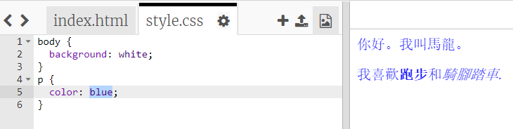

## 什麼是CSS？

CSS代表 **級聯樣式表**，它是一種用於對網頁進行樣式設置並使其看起來不錯的語言。

+ 此代碼將您的網頁鏈接到CSS文件 - 查看您是否可以在HTML文檔的 `<head>` 中找到它：


CSS列出了所有 **屬性** 的特定標籤。

+ 點擊 `style.css` 標籤查看您的網頁的CSS代碼。
    
    

+ 找到這個代碼：

```html
p {color：black; }
```

此CSS代碼確定段落的屬性（`p`），它表示文本顏色應為黑色。注意美國的拼寫：'顏色'。

+ 將CSS代碼中的“black”一詞更改為“blue” (藍色)。你應該看到所有段落的文字顏色變成藍色。

