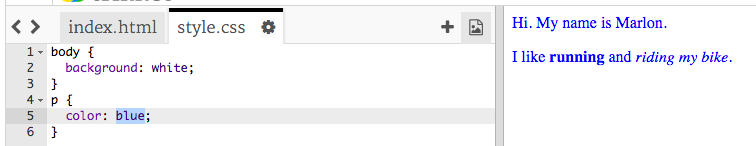

## 什麼是CSS？

CSS代表 **階層式樣式表**，它是一種用來設置網頁樣式並將其美化的語言。

+ 這段程式會將您的網頁連結到一個CSS文件－看看您是否可以在HTML文檔中的 `<head>` 找到它：


CSS列出了所有 **屬性** 的特定標籤。

+ 點擊 `style.css` 標籤以查看您網頁的CSS程式。
    
    

+ 找出這段程式：

```html
p {
    color: black;
}
```

這段CSS程式決定了段落的屬性(`p`)，它代表文字顏色應為黑色。請留意美式的拼寫：'color'。

+ 將CSS程式中的“black”一詞更改為“blue” (藍色)。你應該會看到所有段落的文字都變成了藍色。

