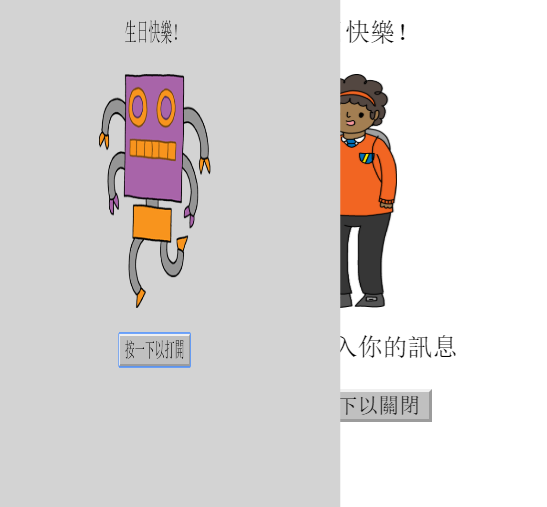
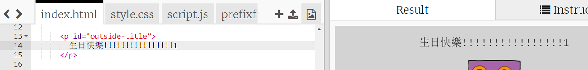
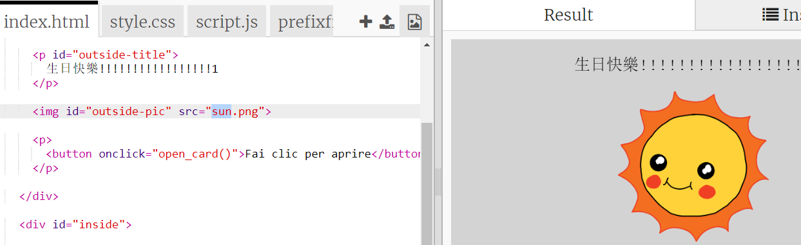
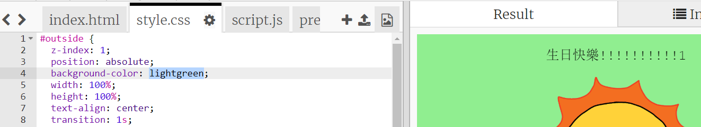
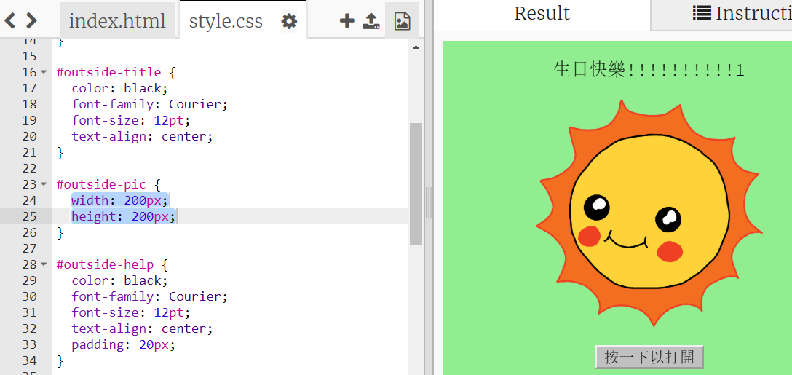
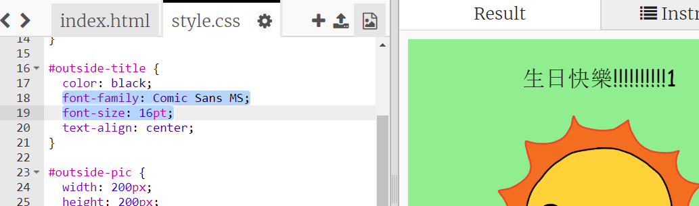

## 做個生日卡片

用你學到的 HTML 與 CSS 來做出屬於自己的生日賀卡。

+ 打開[這個 trinket](https://trinket.io/html/4fc5cdf01a){:target="_blank"}。

我們已經寫好一些代碼來幫你開頭，不過生日卡片看起來還是很單調，你需要透過 HTML 和 CSS 代碼進行修改。

+ 點擊卡片正面的按鈕，會看到它揭開了裡面的內容。

+ 移至 HTML 的第 14 行。試著編輯文字來自訂你的卡片。

+ HTML 中哪些代碼與機器人（robot）的圖片有關，你能找到嗎？找到後把 `robot` 改成 `sun`，會發生什麼？

--- hints ---
 --- hint ---

+ 該代碼在第 17 行。
+ 將單詞 `robot` 更改成 `sun`，就會看到圖案改變了！

--- /hint ------ /hints ---

你也可以把單詞改成 `boy`, `diamond`, `dinosaur`, `flowers`, `girl`, `rainbow`, `robot`, `spaceship`, `sun`, `tea`, `trophy` 來做生日卡，或者用 `cracker`, `elf`, `penguin`, `present`, `reindeer`, `santa`, `snowman` 來做個耶誕卡。

你還可以編輯卡片的 CSS 程式碼。

+ 切換到 `style.css` 頁籤，**outside** 部分指的是卡片「外面」的樣式。

+ 把背景顏色（`background-color`） 改成淺綠 （`lightgreen`）。

+ 你還可以更改圖像的尺寸。 移至 `#outside-pic` 部分，將它的寬（`width`）和高（`height`）改成 `200px`（`px` 代表像素）。

+ 字體也可以改變。移至 ` #outside-title` 區塊，把字體家族（`font-family`）改為 `Comic Sans MS`，再將字體尺寸（`font-size`）改成 `16pt`。

你也可以使用其他字體，例如：

+ `Arial`
+ `Impact`
+ `Tahoma`