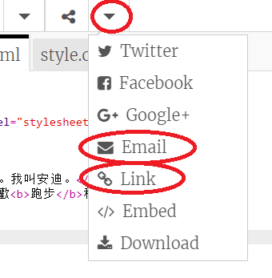

\--- challenge \---

## 挑戰：創造個人賀卡

+ 使用您學到的所有HTML與CSS知識來製作個人化卡片。它不一定得是生日賀卡，也可以是聖誕節或其他場合的賀卡！

這兒有個例子：

您可以在[這裡](http://jumpto.cc/colours)找到更多CSS的顏色名稱{：target =“_ blank”}。

+ 一旦你完成了你的賀卡，你可以分享或通過電子郵件發送給某人。

\--- /challenge \---